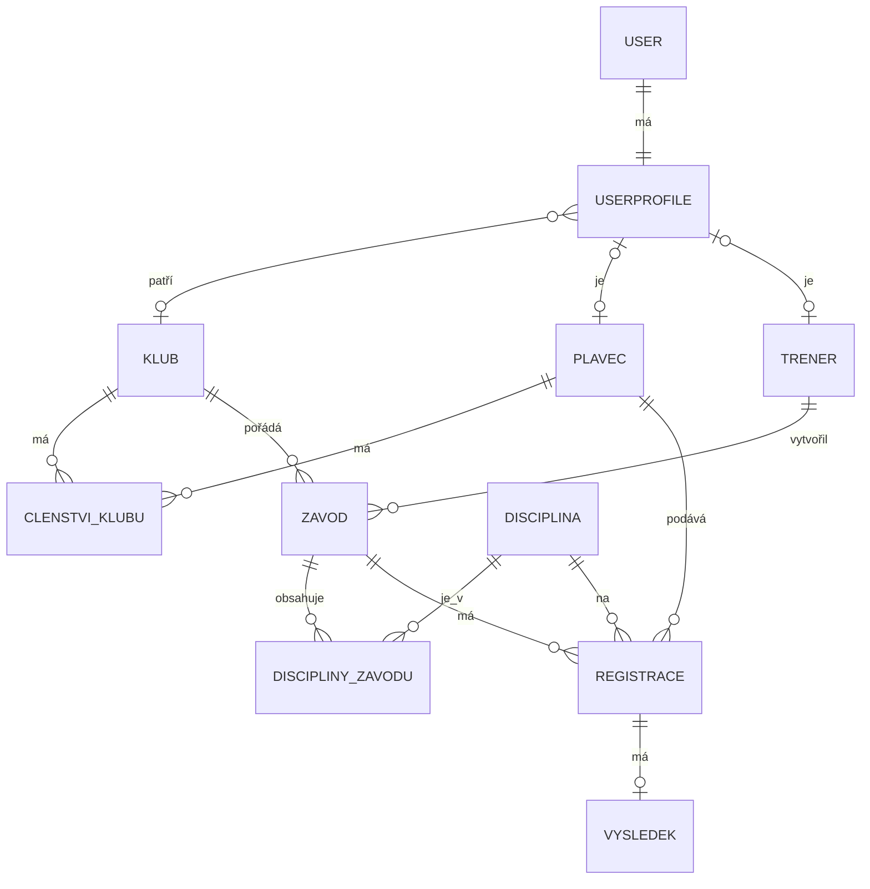

# 🏊‍♂️ SwimPace

Klubová aplikace pro plavce (závodníky) a trenéry, která zjednodušuje organizaci tréninků a závodů. Každý plavecký klub má v aplikaci vlastní oddělený prostor – své trenéry, plavce, závody, přihlášky a výsledky.

> ⚠️ **Aktuálně se jedná o prototyp.** Část funkcí popsaných níže je hotová, část je teprve v plánu (viz [Stav projektu](#-stav-projektu) a [Roadmapa](#-roadmapa)).

Inspirace: [Swimpion](https://www.swimpion.cz), Swim.com

---

## 📌 O projektu

Cílem je vytvořit přehledný systém, kde:

- trenéři plánují závody (a později tréninky) pro svůj klub,
- trenéři přihlašují své svěřence na závody a po skončení zadávají skutečné výsledky,
- plavci vidí své závody, časy, umístění, body a osobní rekordy,
- každý uživatel má svou roli a odpovídající oprávnění,
- součástí bude docházka a statistiky plavců (výsledky, body FINA).

Aplikace **negeneruje náhodné výsledky** – trenér po skončení závodu zadává skutečné časy, umístění a body.

Hlavní tok aplikace:

```text
Klub vznikne nebo se vybere
  -> trenér vytvoří závod
  -> trenér přidá disciplíny
  -> trenér přihlásí své plavce
  -> závod proběhne
  -> po skončení trenér zadá výsledky
  -> plavci si výsledky zobrazí
```

---

## 🤖 Technologie

- Python / Django
- SQLite (vývoj), později případně PostgreSQL
- Docker *(plánováno)*

---

## 👥 Uživatelské role

### 🛠️ Administrátor
- spravuje celou aplikaci (kluby, uživatele, závody, disciplíny),
- řeší problematické nebo duplicitní záznamy,
- má přístup ke všem klubům.

### 🧑‍🏫 Trenér
- patří ke konkrétnímu klubu (lze rozlišit běžného trenéra a správce klubu),
- spravuje své svěřence a zve plavce do klubu,
- vytváří závody pro svůj klub a přidává k nim disciplíny,
- přihlašuje plavce na disciplíny,
- po skončení závodu zadává a upravuje výsledky,
- sleduje statistiky a přehled klubu.

### 🏊‍♂️ Plavec
- při registraci nemusí patřit do žádného klubu,
- vidí svůj osobní profil a může přijmout pozvánku do klubu,
- po aktivaci členství vidí klubový dashboard,
- vidí své závody, časy, umístění, body a osobní rekordy,
- **nemůže** měnit oficiální výsledky.

### 📋 Přehled oprávnění

| Akce | Administrátor | Trenér (svůj klub) | Plavec s členstvím | Plavec bez klubu |
|---|:---:|:---:|:---:|:---:|
| Správa klubů a uživatelů | ✅ | ❌ | ❌ | ❌ |
| Vytvoření závodu | ✅ | ✅ | ❌ | ❌ |
| Přihlášení plavců na závod | ✅ | ✅ | ❌ | ❌ |
| Zadání / úprava výsledků | ✅ | ✅ (po skončení závodu) | ❌ | ❌ |
| Pozvání plavce do klubu | ✅ | ✅ | ❌ | ❌ |
| Přijetí pozvánky | – | – | ✅ | ✅ |
| Klubový dashboard | ✅ | ✅ | ✅ | ❌ |
| Vlastní profil, výsledky, rekordy | ✅ | ✅ | ✅ | ✅ (jen profil) |
| Veřejné závody a výsledky | ✅ | ✅ | ✅ | ✅ |

---

## 🏢 Oddělení klubů

Každý klub má vlastní dashboard a vlastní data. **Trenér klubu A nesmí vidět ani upravovat interní data klubu B.**

Klubová data: trenéři, plavci, závody, disciplíny závodů, registrace, výsledky, statistiky.

Přístup se **nikdy neurčuje podle jména trenéra ani názvu klubu**, ale podle skutečných databázových vazeb a filtrování podle `klub_id`.

```text
User
  -> UserProfile
       -> role
       -> klub

Klub
  -> trenéři
  -> plavci
  -> závody

Závod
  -> disciplíny závodu
  -> registrace

Registrace
  -> výsledek
```

Aplikace je rozdělena na tři části:

- **Veřejná část** – seznam závodů, zveřejněné výsledky, kluby, základní profily.
- **Klubová část** – dashboard klubu, trenéři, plavci, přihlášky, výsledky.
- **Administrace** – správa klubů, závodů, disciplín a účtů.

---

## 🔐 Registrace a členství v klubu

### Trenér
Při registraci trenér:

- vybere existující klub, **nebo**
- zvolí „Můj klub není v seznamu“ a vytvoří nový (název, město, stát, případně datum založení).

Název klubu (resp. kombinace názvu a města) se kontroluje proti duplicitám. Po vytvoření klubu je trenér k němu automaticky přiřazen.

### Plavec
Plavec při registraci klub **nevybírá**. Začíná jako plavec bez klubu – vidí pouze svůj profil a čeká na pozvánku od trenéra.

### Přidání plavce do klubu
Nejbezpečnější je pozvánka nebo pozvánkový kód (přidávání podle jména je rizikové kvůli shodným jménům):

```text
Plavec se zaregistruje
  -> nemá klub
  -> trenér vytvoří pozvánku nebo kód
  -> plavec pozvánku přijme
  -> členství se aktivuje
  -> plavec získá přístup ke klubovému dashboardu
```

Členství je samostatný model, aby se zachovala historie přestupů mezi kluby (výsledky zůstanou spojené s původním klubem).

Stavy členství: `čeká na potvrzení` · `aktivní` · `odmítnuté` · `ukončené`

---

## 🏆 Závody

Trenér při vytváření závodu vyplní:

- název, datum, čas začátku, čas konce (nebo předpokládanou délku),
- místo a typ bazénu (25 m / 50 m),
- popis nebo poznámku,
- disciplíny závodu.

Závod patří klubu a eviduje trenéra, který ho vytvořil.

### Stav závodu
Stav se určuje **automaticky podle data a času**, neukládá se ručně:

| Stav | Význam | Co lze dělat |
|---|---|---|
| **Nadcházející** | závod ještě nezačal | detail, přihlášení plavců |
| **Probíhající** | závod začal, ještě neskončil | detail, výsledky zatím nelze zadávat |
| **Ukončený** | závod skončil | zadání / úprava a zobrazení výsledků |

> Výsledky lze zapisovat až po skončení závodu. Pro zadání starších závodů bude možnost „závod již proběhl“, ale ta nesmí umožnit zápis výsledků u budoucího závodu.

---

## 🏊 Disciplíny

Databáze obsahuje **katalog všech závodních disciplín**. Trenér je při vytváření závodu nevytváří znovu, pouze vybere, které se v daném závodě plavou.

- **Individuální:** 50 / 100 / 200 / 400 / 800 / 1500 m volný způsob, 50 / 100 / 200 m znak, prsa a motýlek, 200 / 400 m polohový závod
- **Štafety** *(do budoucna):* 4 × 50 m a 4 × 100 m volný způsob, polohové štafety, mužské / ženské / smíšené

Model `Disciplina`: název, délka, styl (stabilní interní hodnota, např. `volny_zpusob`; český název jen pro zobrazení), kategorie / pohlaví, typ (individuální / štafeta), aktivní.

Konkrétní závod má vlastní výběr disciplín přes vazbu:

```text
Zavod -> DisciplinyZavodu -> Disciplina
```

`DisciplinyZavodu` obsahuje pořadí, číslo disciplíny a případně čas začátku.

Ve formuláři závodu bude: výběr jednotlivých disciplín, **Vybrat vše**, **Zrušit vše**, **Vybrat individuální**, **Vybrat štafety**.

---

## 📝 Registrace a výsledky

Registrace na závod **není** výsledek – jsou to dvě oddělené věci.

**Registrace:** závod, plavec, disciplína, stav (`přihlášen` / `odhlášen` / `dokončil` / `nedokončil` / `diskvalifikován`), trenér, který ji vytvořil, datum vytvoření a úpravy. Kombinace závod + plavec + disciplína je unikátní.

**Výsledek:** registrace, čas, umístění, body, poznámka, trenér, který výsledek zadal, datum poslední úpravy. Výsledek existuje až ve chvíli, kdy je potřeba zaznamenat výkon.

**Čas** se ukládá jako počet setin sekundy (`1:04.37` → `6437`) a při zobrazení se formátuje zpět. **Umístění** může aplikace dopočítat podle časů v disciplíně; trenér ho může ručně opravit (shodný čas, diskvalifikace, oficiální výsledky).

---

## 🧩 Datový model



> Diagram odpovídá cílovému stavu. Některé vazby (členství, vlastnictví závodu klubem, `DisciplinyZavodu`) zatím nejsou v kódu hotové – viz Roadmapa.

---

## 📊 Dashboardy

### Trenér
Vidí pouze svůj klub: přehled klubu, seznam trenérů a plavců, pozvánky a členství, závody rozdělené na nadcházející / probíhající / ukončené, vytvoření závodu, přihlášení plavců, **hromadné zadávání výsledků v tabulce** a klubové statistiky.

### Plavec
Vidí své osobní údaje, stav členství, nadcházející a dokončené závody, výsledky, historii časů podle disciplín (po rozkliknutí závodu), **osobní rekordy** (filtrovatelné podle stylu, vzor Swimpion), umístění a body. Docházka na tréninky přijde v budoucím rozšíření.

Plavec bez klubu vidí jen svůj profil a případné pozvánky.

---

## 🏋️‍♂️ Tréninky *(plánovaná funkce)*

Trenér vytvoří trénink s místem (bazén), popisem, plánem (série, vzdálenosti) a datem a časem. Plavci se na něj přihlásí a vzniká docházka.

---

## 🔒 Bezpečnostní a validační pravidla

- Uživatel nesmí získat přístup k datům klubu změnou ID v URL.
- Každý klubový dotaz je filtrován přes klub přihlášeného uživatele.
- Trenér spravuje pouze svůj klub a své svěřence; plavce může přihlásit jen ze svého klubu.
- Plavec může upravovat pouze vlastní neoficiální údaje.
- Výsledky zadává pouze oprávněný trenér po skončení závodu.
- Disciplína musí patřit ke konkrétnímu závodu; registrace je unikátní.
- Čas nesmí být záporný, umístění musí být kladné (pokud je vyplněné), body mají validovaný rozsah.
- Klub a závod nesmí vznikat s prázdnými povinnými údaji.
- Oprávnění mezi kluby budou pokryta testy (povolený i zakázaný přístup).

---

## ✅ Stav projektu

**Hotovo (základ):**

- základní modely: klub, plavec, trenér, disciplína, závod, registrace, výsledek
- vazba uživatelského profilu na klub a na plavce / trenéra
- samostatný model `Registrace` s unikátností závod + plavec + disciplína a stavem registrace
- přesný čas v setinách sekundy
- evidence uživatele, který výsledek zadal
- zápis trenéra vytváří registraci místo falešného výsledku (starší data byla zachována)

**Další hlavní etapa:** převést tuto logiku do uživatelského rozhraní – klubový dashboard, vytváření závodů, katalog disciplín, pozvánky plavcům a trenérské zadávání výsledků.

---

## 🗺️ Roadmapa

- [ ] 1. Vlastnictví závodu klubem a trenérem
- [ ] 2. Model členství / pozvánek do klubu
- [ ] 3. Úprava registrace trenéra a plavce podle nového toku
- [ ] 4. Trenérský dashboard filtrovaný podle klubu
- [ ] 5. Formulář pro vytvoření závodu
- [ ] 6. Katalog všech disciplín a možnost „Vybrat vše“
- [ ] 7. Přihlašování plavců na disciplíny
- [ ] 8. Zablokování zadávání výsledků před koncem závodu
- [ ] 9. Hromadný formulář pro výsledky
- [ ] 10. Automatický výpočet / kontrola umístění
- [ ] 11. Dashboard plavce
- [ ] 12. Osobní rekordy a statistiky (včetně bodů FINA)
- [ ] 13. Testy oprávnění mezi kluby
- [ ] 14. Opravy validací vstupů a UI (méně scrollování, čitelnost hlavičky, bílý text nahoře)
- [ ] 15. Refaktor: přidání statických metod a maker pro přehlednost
- [ ] 16. OAuth přihlášení
- [ ] 17. Docker a produkční nasazení

### 🚀 Budoucí rozšíření

- tréninky a docházka
- štafety
- notifikace
- chat mezi trenérem a plavcem

---

## 📂 Struktura projektu

```text
SwimPace/
├── add_disciplines.py
├── check_registrations.py
├── create_future_zavod.py
├── create_trener.py
├── db.sqlite3
├── manage.py
├── plavecke_zavody/
│   ├── __init__.py
│   ├── asgi.py
│   ├── settings.py
│   ├── urls.py
│   └── wsgi.py
├── register_petr.py
├── requirements.txt
└── zavody/
    ├── __init__.py
    ├── admin.py
    ├── apps.py
    ├── models.py
    ├── tests.py
    ├── views.py
    ├── migrations/
    │   ├── 0001_initial.py
    │   ├── 0002_userprofile.py
    │   ├── 0003_vysledek_cas.py
    │   └── __init__.py
    └── templates/
        ├── base.html
        └── zavody/
            ├── add_plavec_to_klub.html
            ├── add_sverenek.html
            ├── home.html
            ├── klub_detail.html
            ├── kluby_list.html
            ├── login.html
            ├── plavci_list.html
            ├── plavec_detail.html
            ├── profile.html
            ├── register.html
            ├── stat_detail.html
            ├── stat_list.html
            ├── trener_detail.html
            ├── treneri_list.html
            ├── zapsat_plavce_na_zavod.html
            ├── zavod_detail.html
            └── zavody_list.html
```

---

## 💻 Spuštění projektu

```bash
git clone https://github.com/TVUJ-UCET/TVUJ-REPOZITAR.git
cd SwimPace

python3 -m venv .venv
source .venv/bin/activate        # Windows: .venv\Scripts\activate
python -m pip install -r requirements.txt

python manage.py migrate
python manage.py runserver
```

Virtuální prostředí `.venv` se na GitHub nahrávat nemá – na každém počítači se vytvoří znovu.

Uložení změn:

```bash
git add .
git commit -m "Popis změn"
git push
```

---

## 🎓 Závěrečný školní projekt

Tato aplikace je vytvářena jako závěrečný školní projekt.
